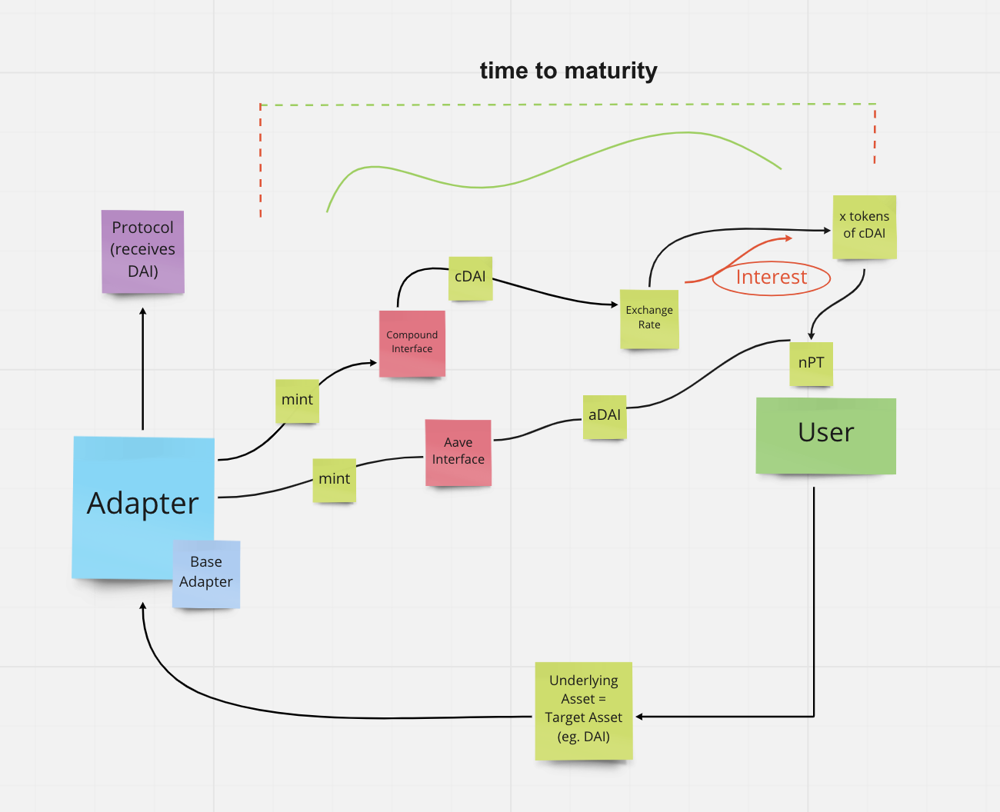

# Napier Finance 

NOTE: This code is not audited and should not be used in production environment.
The repository is under continuous development. 

## Summary  

Napier Finance is a fully decentralized yield stripping protocol that enables users to trade fixed and variable rates efficiently. Napier is building the Napier Space AMM, the most capital efficient AMM featuring permissionless listings and unified liquidity. Napier Finance opens up new options for DeFi yields without the need for trusted intermediaries.

The specificity of Napier Finance is that it processes multiple principal tokens (that has same underlying asset, same maturity, different with yield sources) as a single principal token. 
You don't to use Aave, Compound, Yearn and other AMM separatly to diversify your strategies. You can use Napier Finance and save gas fees and benefit from different yield strategies in a single transaction. 

With Unified liquidity Napier Finance will bring significant capital efficiency improvements to existing YieldSpaces.


## Requirements 

[Foundry](https://book.getfoundry.sh/)

- Compiling : ``` forge build ```
- Testing :  ``` forge test -vvv --fork-url=$RPC_URL --fork-block-number=<block number> ``` 

## Napier Space AMM


## Napier v1 protocol 

- Yield Striping Application  : 

This allows users to decompose their Interest-bearing Token into a Principal Token and a Yield Token that represents a claim on Principal and claim on Yield. 
Principal tokens redeem the underlying asset with a yield at maturity 1 for 1, while yield tokens provide the yield accruing on the underlying asset until maturity. 
The existence of PT and YT allows users to safely earn and borrow at fixed rates and trade based on future yields without the risk of liquidation or capital lockup.


## Contracts 

-  Napier Principal Token interface : nPT 


- Adapters :

Adapters hold the logic for stripping yield from yield-bearing assets. 
For the adapters Napier is using non-airdrop Adapter implementations that must inherit BaseAdapter  and override these functions : 

```
scale()
getUnderlyingPrice()
wrapUnderlying()
unwrapTarget()
```




## Useful Ressources

[Napier Finance](https://kita71yusuke.gitbook.io/napier-finance/)


# Gas optimization 

## Signle tx-bundles with Napier Principal Token as a Batcher 

**The less gas you can spend the more you can be profitable.** 

Instead of sending two transactions, for example deposit underlying asset in P1 with Y1 and deposit same underlying asset in P2 
with Y2, Napier Finance allows users to use Single-tx Bundles in an abstract manner. In fact, Napier Principal Token is a batcher
of different yields and can be used a Bundle for pools. 

Napier Finance smart contract is what you will call sending only one transaction which calls Napier SM which will process those transactions and returns a Yield. 


## Solidity 

We are using mev assembly code for CREATE2 function and we are keeping developing our functions and smart contracts to save the more 
possible gas. 

In terms of security, security is not the most important part, but gas is, since this is an mev hackathon and our goal is to provide
more opportunities for our users to have the best yield and save gas. 


# Futur plans 

- JIT || TWAMM are future plan to avoid price manipulation


