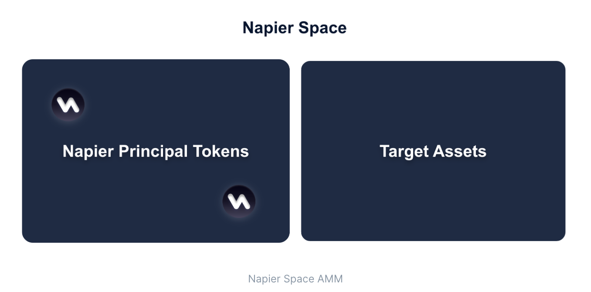
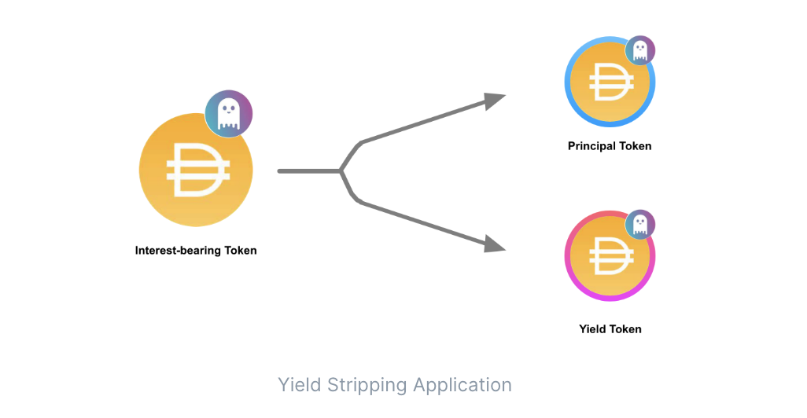

# Napier Finance 

## Napier Finance                 

NOTE: This code is not audited and should not be used in production environment.
This is the official repository for MEV Hackathon 2022 with Encode Club

## Summary  

Napier Finance is a fully decentralized yield stripping protocol that enables users to trade fixed and variable rates efficiently. Napier is building the Napier Space AMM, the most capital efficient AMM featuring permissionless listings and unified liquidity. Napier Finance opens up new options for DeFi yields without the need for trusted intermediaries.

We are tackling the problem of Yield Space. 

## Napier Space AMM

## Napier v1 protocol 

- Yield Striping Application  : 

This allows users to decompose their Interest-bearing Token into a Principal Token and a Yield Token that represents a claim on Principal and claim on Yield. 
Principal tokens redeem the underlying asset with a yield at maturity 1 for 1, while yield tokens provide the yield accruing on the underlying asset until maturity. 
The existence of PT and YT allows users to safely earn and borrow at fixed rates and trade based on future yields without the risk of liquidation or capital lockup.

### Contracts 

AdaptersContractsAave deployed : [Mumbai  contract](https://mumbai.polygonscan.com/address/0x5bEa99Fcdca784bB9EbBF7a070FEB567a55581D5)

### How it works : Proof of Price Variation 

ADD DIAGRAM

 
### Arbitrage Strategies  

### Inspiration 

To reduce the risk of having a sandwich attack AMM DEXs began offering Time Weighted Average Price (TWAP) oracles. TWAP is a pricing methodology that calculates the mean price of an asset during a specified period of time. For example, a “one-hour TWAP” means taking the average price over a defined hour of time. 

Cross-exchange market making :

- Less liquid market : make order 
- More Liquid market : taker order 

### Strategy 

It is important to choose the right dex or in other words the route to be profitable, and for this you have to : 

- Take into account the tax(fees) in the arbitrage while setting up orders. 
- Oracle exchange price feed choice : not necessarily the connected exchange <depends on strategy : more liquid exchange will give you more insight into the potential direction of token price> 

### Documentation 

[Analysis tool for dexs](https://kita71yusuke.gitbook.io/napier-finance/)

### MEV Integration 

- PriceFeed 
- Keepers 

### Advantages 

### Future 

- Friendly user-interface. 
- 
