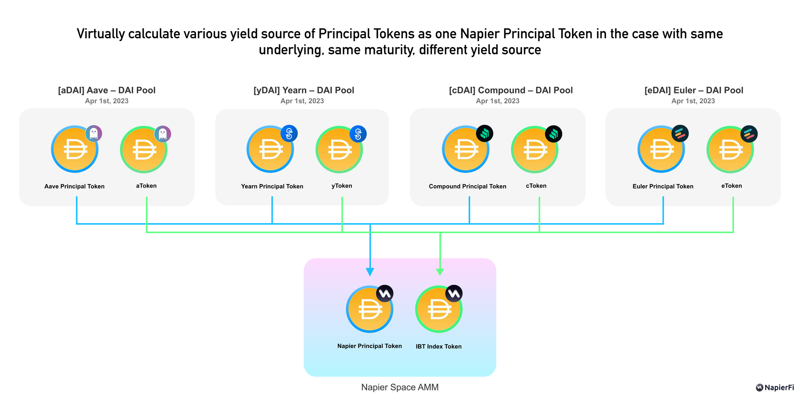
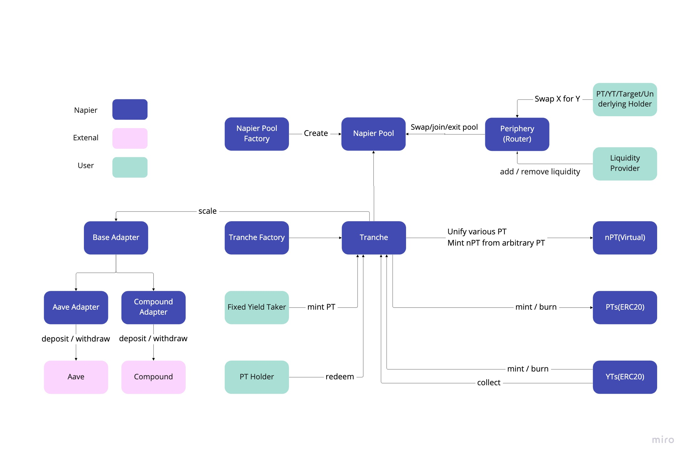

# Napier Finance - Yield Stripping app featuring the most efficient AMM

NOTE: This code is not audited and should not be used in production environment.
The repository is under continuous development.

## Summary

### Introducing Napier Finance

Napier Finance is a fully decentralized yield stripping protocol that enables users to trade fixed and variable rates efficiently. Then the competitive advantage, Napier Space AMM is the most capital efficient AMM among DeFi Fixed Rates Field for any yield source, featuring unified liquidity.

### Our Solution : Unified Principal Tokens Liquidity

Napier Finance introduces a unique unified liquidity AMM concept to the DeFi space. When providing liquidity, virtually calculate various yield source of Principal Tokens as one Napier Principal Token in the case with same underlying, same maturity, different yield source. This leads to higher exchange fee APY for liquidity providers, which in turn improves overall liquidity, leads to lower slippage and creates a user-friendly market.



In addition, with the exponential birth of yield-producing protocols, Napier's target yield source protocols will also expand, and it is expected that Napier's ecosystem will grow. The more exponential birth of yield-producing protocols, the more Napier's ecosystem is expected to grow.


## Requirements

[Foundry](https://book.getfoundry.sh/)

To run tests you need access to an archive node like the free ones from [Alchemy](https://al
chemyapi.io/). Create `.env` file and paste the rpc url.

Then set the environment variable.

```bash
RPC_URL=<Mainnet rpc url>
```

- Compiling : `forge build`
- Testing : `forge test -vvv`

## Overview



## Useful Resources

[Napier Finance](https://kita71yusuke.gitbook.io/napier-finance/)

## Future feature

- Solutions for large orders
